# Networking Workshop — Java

A hands-on workshop covering fundamental networking concepts in Java: URLs, TCP/UDP sockets, datagrams, and RMI (Remote Method Invocation).

**Author:** Juan Carlos Bohórquez Monroy

---

## Table of Contents

- [Project Structure](#project-structure)
- [Tech Stack](#tech-stack)
- [How to Run](#how-to-run)
- [Exercises](#exercises)
- [1. URL Info Printer](#1-url-info-printer)
- [2. URL Browser](#2-url-browser)
- [4.3.1. Square Server](#431-square-server)
- [4.3.2. Trig Server](#432-trig-server)
- [4.4. Basic HTTP Server](#44-basic-http-server) 
- [4.5.1. Multi-Request Web Server](#451-multi-request-web-server) 
- [5.2.1. Datagram Time Client](#521-datagram-time-client)
- [6.4.1. RMI Chat](#641-rmi-chat)
- [Workshop Launcher](#workshop-launcher)
- [TCP Client Utility](#tcp-client-utility)

---

## Project Structure

```
src/
├── main/
│   ├── java/edu/eci/arsw/networking/
│   │   ├── NetworkingWorkshopApplication.java   # Spring Boot entry point
│   │   ├── WorkshopLauncher.java                # Interactive menu launcher
│   │   ├── util/
│   │   │   └── TcpClient.java                   # Generic TCP client for testing
│   │   ├── ejercicio1/                           # URL Info Printer
│   │   ├── ejercicio2/                           # URL Browser
│   │   ├── ejercicio4_3_1/                       # Square Server
│   │   ├── ejercicio4_3_2/                       # Trig Server
│   │   ├── ejercicio4_4/                         # Basic HTTP Server
│   │   ├── ejercicio4_5_1/                       # Multi-Request Web Server
│   │   ├── ejercicio5_2_1/                       # Datagram Time Client
│   │   └── ejercicio6_4_1/                       # RMI Chat
│   └── resources/
│       └── application.properties
└── test/java/edu/eci/arsw/networking/
    └── NetworkingWorkshopApplicationTests.java
```

---

## Tech Stack

| Technology | Version |
|------------|---------|
| Java | 21 |
| Spring Boot | 4.0.6 |
| Maven | 3.9.16 |

---

## How to Run

### Compile all exercises

```bash
mvn compile
```

### Interactive launcher (menu)

```bash
# Via batch script
run_ejercicio.bat

# Via java directly (after compilation)
java -cp target/classes edu.eci.arsw.networking.WorkshopLauncher
```

From the menu you can type:
- `1` → URL Info Printer
- `4_3_1` → Square Server
- `4_3_1_c` → TCP Client connected to Square Server
- `4_3_2` → Trig Server
- `4_3_2_c` → TCP Client connected to Trig Server
- `0` → Exit

### Run a specific exercise directly

```bash
run_ejercicio.bat 1          # URL Info Printer
run_ejercicio.bat 4_3_1      # Square Server (listens on port 35000)
run_ejercicio.bat 4_3_2      # Trig Server (listens on port 35000)
```

Or with `java` directly:

```bash
java -cp target/classes edu.eci.arsw.networking.ejercicio1.URLInfo
java -cp target/classes edu.eci.arsw.networking.ejercicio4_3_1.SquareServer
```

### Run the TCP client for a server exercise

For exercises that implement a TCP server (4.3.1, 4.3.2), open **two terminals**:

**Terminal 1 — Server:**
```bash
run_ejercicio.bat 4_3_1
```

**Terminal 2 — Client:**
```bash
run_ejercicio.bat 4_3_1 client
```

Or with `java` directly:
```bash
java -cp target/classes edu.eci.arsw.networking.util.TcpClient localhost 35000
```

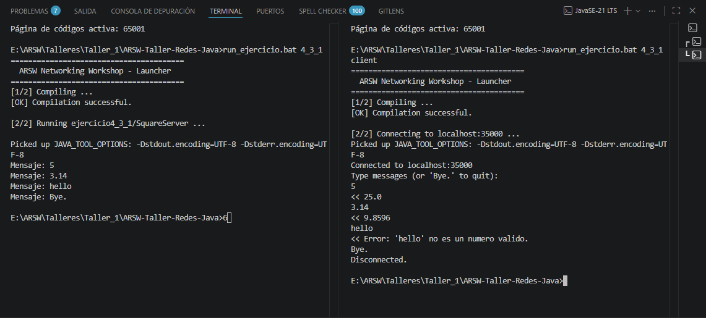

---

## Exercises

### 1. URL Info Printer 

**Package:** `edu.eci.arsw.networking.ejercicio1` — **Completed**  
**File:** `src/main/java/edu/eci/arsw/networking/ejercicio1/URLInfo.java`

#### What it does

Decomposes a URL into its 8 structural components and prints each one. This teaches how a URL is parsed by Java — every web address you type in a browser is internally broken into protocol, host, port, path, etc.

#### Step-by-step implementation

| Step | What I did | Why |
|------|-------------|-----|
| 1 | Import `java.net.URL` and `java.net.MalformedURLException` | `URL` is the core class for working with URLs; `MalformedURLException` is thrown when the URL string is invalid |
| 2 | Create a `URL` object with a full URL containing protocol, host, port, path, query and fragment | To test all 8 getter methods we need a URL that has every possible component |
| 3 | Call `url.getProtocol()` and print it | Extracts `http` — identifies the communication protocol |
| 4 | Call `url.getAuthority()` and print it | Extracts `ldbn.escuelaing.edu.co:80` — combines host and port |
| 5 | Call `url.getHost()` and print it | Extracts `ldbn.escuelaing.edu.co` — the server name |
| 6 | Call `url.getPort()` and print it | Extracts `80` — the port number (returns `-1` if not explicitly set) |
| 7 | Call `url.getPath()` and print it | Extracts `/index.html` — the resource path on the server |
| 8 | Call `url.getQuery()` and print it | Extracts `query=value` — the query string after `?` |
| 9 | Call `url.getFile()` and print it | Extracts `/index.html?query=value` — combines path and query |
| 10 | Call `url.getRef()` and print it | Extracts `seccion` — the fragment after `#` |
| 11 | Wrap everything in a `try-catch` block | `MalformedURLException` is a checked exception, the compiler requires us to handle it |

#### Why this matters

Understanding URL decomposition is the foundation for web programming. Every HTTP request, REST API call, or web scraping task relies on being able to construct and parse URLs correctly. The 8 methods map directly to the parts of a URL shown in every browser's address bar.

#### Methods used

| Method | Returns | Example output |
|--------|---------|----------------|
| `getProtocol()` | Protocol | `http` |
| `getAuthority()` | Host:Port | `ldbn.escuelaing.edu.co:80` |
| `getHost()` | Host name | `ldbn.escuelaing.edu.co` |
| `getPort()` | Port number | `80` |
| `getPath()` | Path component | `/index.html` |
| `getQuery()` | Query string | `query=value` |
| `getFile()` | Path + Query | `/index.html?query=value` |
| `getRef()` | Fragment anchor | `seccion` |

#### Test URL

```
http://ldbn.escuelaing.edu.co:80/index.html?query=value#seccion
```

#### Expected output

```
URL: http://ldbn.escuelaing.edu.co:80/index.html?query=value#seccion
Protocol: http
Authority: ldbn.escuelaing.edu.co:80
Host: ldbn.escuelaing.edu.co
Port: 80
Path: /index.html
Query: query=value
File: /index.html?query=value
Ref: seccion
```

#### Run

```bash
run_ejercicio.bat 1
```

Or using `java` directly:
```bash
java -cp target/classes edu.eci.arsw.networking.ejercicio1.URLInfo
```

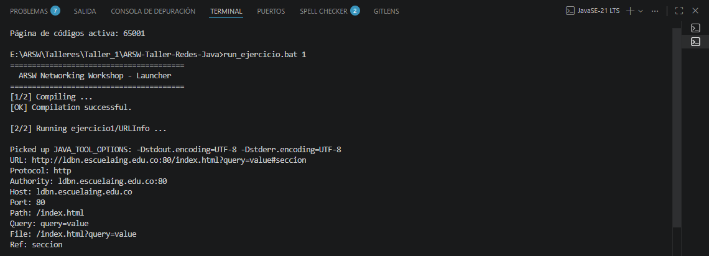

---

### 2. URL Browser 

**Package:** `edu.eci.arsw.networking.ejercicio2` — **Completed**  
**File:** `src/main/java/edu/eci/arsw/networking/ejercicio2/URLBrowser.java`

#### What it does

Acts like a minimal web browser: asks the user for a URL, fetches the HTML content from that address, and saves it to a file called `resultado.html`. This teaches how to read data from the internet using Java streams, the same mechanism browsers use under the hood.

#### Step-by-step implementation

| Step | What I did | Why |
|------|-------------|-----|
| 1 | Import `java.util.Scanner` | `Scanner` reads user input from the console |
| 2 | Import `java.net.URL` and `java.net.MalformedURLException` | `URL` represents the remote resource; `MalformedURLException` handles invalid URLs |
| 3 | Import `java.io.BufferedReader`, `InputStreamReader`, `PrintWriter`, `FileWriter`, `IOException` | These handle reading from the network and writing to a file |
| 4 | Prompt the user with `System.out.print("Enter a URL: ")` and read input with `scanner.nextLine()` | The exercise requires the user to enter any URL they want |
| 5 | Create a `URL` object from the user's input inside a `try` block | `new URL(string)` parses and validates the URL format |
| 6 | Call `url.openStream()` to open a connection | `openStream()` returns an `InputStream` connected to the remote server |
| 7 | Wrap the stream in `InputStreamReader` then `BufferedReader` | `BufferedReader` allows reading line-by-line, which is efficient for text content |
| 8 | Create a `PrintWriter` wrapping a `FileWriter("resultado.html")` | `PrintWriter.println()` writes each line to the output file |
| 9 | Loop: `while ((line = reader.readLine()) != null)` | Reads the remote content line by line until the end of the stream |
| 10 | Inside the loop: `writer.println(line)` | Each line is written to `resultado.html`, preserving the original formatting |
| 11 | Use try-with-resources for both reader and writer | Ensures both streams are closed automatically, even if an error occurs |
| 12 | Catch `MalformedURLException` | Handles invalid URL syntax (e.g., missing `http://`) |
| 13 | Catch `IOException` | Handles network errors (e.g., server unreachable, DNS failure) |

#### Why this matters

This is the foundation of web scraping and HTTP clients. The same pattern (open stream → read → process) is used by:
- **Web crawlers** that download pages for indexing
- **REST clients** that consume JSON/XML APIs
- **Download managers** that fetch files from the internet
- **Proxy servers** that read content from one server and forward it to a client

#### Key classes used

| Class | Role |
|-------|------|
| `java.net.URL` | Represents the remote resource and provides `openStream()` |
| `BufferedReader` | Reads text efficiently line by line |
| `InputStreamReader` | Bridge from byte stream to character stream |
| `PrintWriter` | Writes formatted text to the output file |
| `FileWriter` | Creates/appends to `resultado.html` on disk |

#### Run

```bash
run_ejercicio.bat 2
```

Or using `java` directly:
```bash
java -cp target/classes edu.eci.arsw.networking.ejercicio2.URLBrowser
```

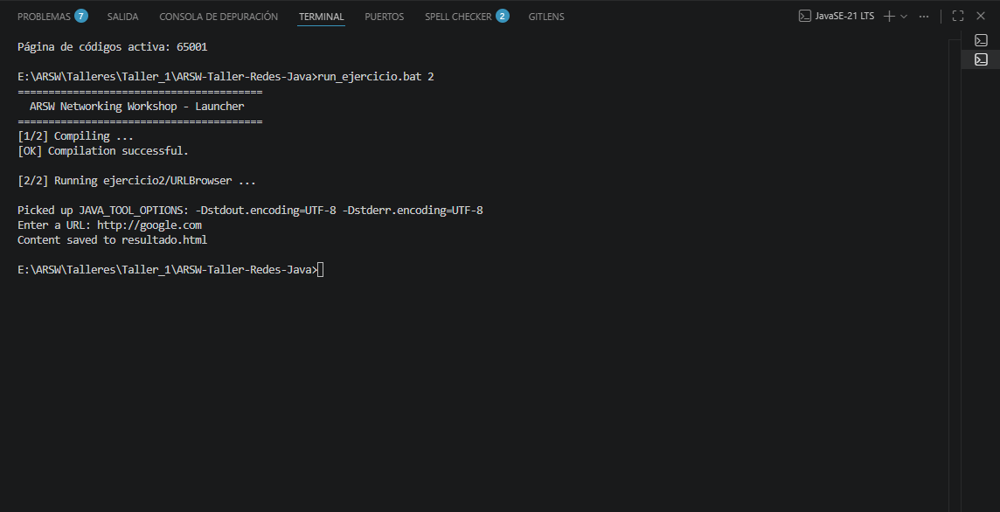
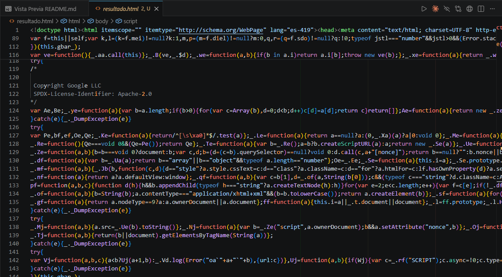

---

### 4.3.1. Square Server 

**Package:** `edu.eci.arsw.networking.ejercicio4_3_1` — **Completed**  
**File:** `src/main/java/edu/eci/arsw/networking/ejercicio4_3_1/SquareServer.java`

#### What it does

A TCP server that listens on port `35000`, receives a number from a client, and responds with the square of that number. This is a direct adaptation of the `EchoServer` example from Section 4.2 of the manual — instead of echoing the message back, it parses the input as a number and returns its square.

#### Base template: EchoServer

The implementation follows this exact structure (from Section 4.2 of the workshop manual):

```java
// EchoServer template (Section 4.2)
ServerSocket serverSocket = null;
try { serverSocket = new ServerSocket(35000); }
catch (IOException e) { /* port unavailable */ }

Socket clientSocket = null;
try { clientSocket = serverSocket.accept(); }
catch (IOException e) { /* accept failed */ }

PrintWriter out = new PrintWriter(clientSocket.getOutputStream(), true);
BufferedReader in = new BufferedReader(new InputStreamReader(clientSocket.getInputStream()));

String inputLine, outputLine;
while ((inputLine = in.readLine()) != null) {
    // process inputLine, produce outputLine
    out.println(outputLine);
}
```

#### Step-by-step implementation

| Step | What I did | Why |
|------|-------------|-----|
| 1 | Open a `ServerSocket` on port `35000` | The server needs a fixed port so clients know where to connect |
| 2 | Call `serverSocket.accept()` — blocks until a client arrives | The server is passive; it waits for someone to initiate communication |
| 3 | Get the socket's output stream and wrap it in a `PrintWriter` | `println()` sends text lines to the client |
| 4 | Get the socket's input stream and wrap it in a `BufferedReader` | `readLine()` reads text lines from the client |
| 5 | Enter a `while` loop reading lines | The server stays alive to handle multiple requests from the same client |
| 6 | Check if the line equals `"Bye."` and break early | Provides a clean shutdown protocol — client can politely disconnect |
| 7 | Parse the line as a `double` with `Double.parseDouble()` | The exercise requires receiving a number; `double` accepts integers and decimals |
| 8 | Compute `number * number` and send it back via `out.println()` | The square operation is the core business logic |
| 9 | Catch `NumberFormatException` and send an error message | If the client sends non-numeric text (other than `Bye.`), the server stays up |
| 10 | Close `out`, `in`, `clientSocket`, `serverSocket` in that order | Releases port binding and system resources |

#### Why this matters

This is the foundation of all TCP server applications. Every web server, database server, and chat server follows the same pattern:
- **Bind** to a port
- **Wait** for connections
- **Read** client data
- **Process** it
- **Send** a response
- **Repeat**

The sequential single-client pattern is exactly how early HTTP/1.0 web servers worked.

#### Key classes used

| Class | Role |
|-------|------|
| `java.net.ServerSocket` | Listens for incoming TCP connections on a specific port |
| `java.net.Socket` | Represents the communication endpoint after a connection is established |
| `BufferedReader` | Reads text from the socket's input stream line by line |
| `PrintWriter` | Writes text to the socket's output stream |
| `Double.parseDouble()` | Converts a string to a numeric value for calculation |

#### Example interaction

```
Server console                  Client console
─────────────────────────────────────────────────
                              Connected to localhost:35000
                              Type messages (or 'Bye.' to quit):
Mensaje: 5                    >> 5
                              << 25.0
Mensaje: 3.14                 >> 3.14
                              << 9.8596
Mensaje: hello                >> hello
                              << Error: 'hello' no es un numero valido.
Mensaje: Bye.                 >> Bye.
                              Disconnected.
```

#### Run

**Terminal 1 — Start the server:**
```bash
run_ejercicio.bat 4_3_1
```

**Terminal 2 — Connect with the TCP client:**
```bash
run_ejercicio.bat 4_3_1 client
```

Or with `java` directly:
```bash
java -cp target/classes edu.eci.arsw.networking.ejercicio4_3_1.SquareServer
java -cp target/classes edu.eci.arsw.networking.util.TcpClient localhost 35000
```

---

### 4.3.2. Trig Server 

**Package:** `edu.eci.arsw.networking.ejercicio4_3_2` — **Completed**  
**File:** `src/main/java/edu/eci/arsw/networking/ejercicio4_3_2/TrigServer.java`

#### What it does

A TCP server that receives a number and responds with the result of a trigonometric function applied to that number. By default the function is **cosine** (`cos`). The client can switch between sine, cosine, and tangent at runtime by sending `fun:sin`, `fun:cos`, or `fun:tan`. This teaches **stateful protocol design** — the server remembers the current operation across requests.

#### Base template: EchoServer

Same structure as Exercise 4.3.1, adapted from the `EchoServer` example. The key addition is a static `currentOp` variable that tracks which trigonometric function to apply.

#### Step-by-step implementation

| Step | What I did | Why |
|------|-------------|-----|
| 1 | Declare `private static String currentOp = "cos"` | The default operation is cosine; the string stores the current function name |
| 2 | Open a `ServerSocket` on port `35000` | Same port as the EchoServer template |
| 3 | Accept a client and set up `PrintWriter` / `BufferedReader` | Standard socket I/O setup |
| 4 | Enter the read loop, same as EchoServer | Handle multiple requests from the same client |
| 5 | Check `"Bye."` first, before any processing | Ensures `Bye.` is never misinterpreted as a number or command |
| 6 | Check `startsWith("fun:")` | The `fun:` prefix is the protocol's control command |
| 7 | Extract the function name with `substring(4)`, trim and lowercase | Normalizes input so `fun:SIN`, `Fun:Sin`, `fun:sin` all work |
| 8 | Validate against `"sin"`, `"cos"`, `"tan"` and update `currentOp` | Only valid function names are accepted; others get an error |
| 9 | If input is not `fun:`, parse as `double` | The input is treated as a numeric operand |
| 10 | Use a `switch` on `currentOp` to call `Math.sin()`, `Math.cos()`, or `Math.tan()` | Applies the currently selected function; `cos` is the `default` case |
| 11 | Send the result back via `out.println()` | The client receives the computed value |
| 12 | Catch `NumberFormatException` for invalid input | If the input is neither a number nor a `fun:` command, the server sends an error and continues |

#### Why this matters

This exercise introduces **stateful protocol design** — the server maintains mutable state (the current operation) across multiple client requests. This is a fundamental concept in:
- **FTP servers** that remember the current working directory
- **Database connections** that track transaction state
- **Game servers** that keep player state between moves
- **SSH sessions** that remember authentication state

The `fun:` command pattern is a minimal example of a **control protocol** — a separate channel of communication (distinguished by a prefix) that modifies server behavior rather than providing data.

#### Key classes used

| Class / Method | Role |
|----------------|------|
| `java.net.ServerSocket` | Listens for incoming connections |
| `java.net.Socket` | Communication endpoint |
| `Math.sin() / cos() / tan()` | Trigonometric functions applied to user input |
| `Double.parseDouble()` | Converts string input to a numeric value |
| `String.startsWith()` | Detects `fun:` control commands |
| `String.substring()` | Extracts the function name from the command |
| `switch` statement | Routes `currentOp` to the correct math function |

#### Example interaction

```
Server console                  Client console
─────────────────────────────────────────────────
                              Connected to localhost:35000
                              Type messages (or 'Bye.' to quit):
Mensaje: 0                    >> 0
                              << 1.0                  (cos(0) = 1)
Mensaje: 1.5707963267948966   >> 1.5707963267948966
                              << 6.123233995736766E-17 (cos(π/2) ≈ 0)
Mensaje: fun:sin              >> fun:sin
                              << Operacion cambiada a sin
Mensaje: 0                    >> 0
                              << 0.0                  (sin(0) = 0)
Mensaje: fun:tan              >> fun:tan
                              << Operacion cambiada a tan
Mensaje: 0                    >> 0
                              << 0.0                  (tan(0) = 0)
Mensaje: Bye.                 >> Bye.
                              Disconnected.
```

#### Run

**Terminal 1 — Start the server:**
```bash
run_ejercicio.bat 4_3_2
```

**Terminal 2 — Connect with the TCP client:**
```bash
run_ejercicio.bat 4_3_2 client
```

Or with `java` directly:
```bash
java -cp target/classes edu.eci.arsw.networking.ejercicio4_3_2.TrigServer
java -cp target/classes edu.eci.arsw.networking.util.TcpClient localhost 35000
```

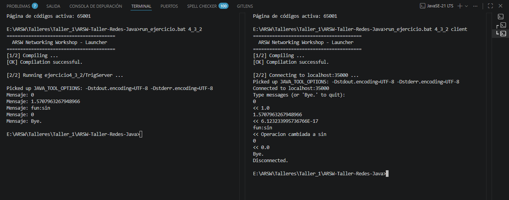

---

### 4.4. Basic HTTP Server 

**Package:** `edu.eci.arsw.networking.ejercicio4_4` — **Completed**  
**File:** `src/main/java/edu/eci/arsw/networking/ejercicio4_4/HttpServer.java`

#### What it does

A minimal HTTP server that listens on port `35000`, accepts a **single** HTTP request, reads the request headers, and responds with a hardcoded HTML page. This teaches how web servers work under the hood — every webpage you visit is delivered by a program that follows this exact pattern: parse an HTTP request → build an HTML response → send it back.

#### Base template: EchoServer

Same `ServerSocket` / `Socket` structure as Exercises 4.3.1/4.3.2. The difference is in the reading logic — instead of processing each line as a command, the server reads all HTTP request headers until no more data is available (`in.ready()` returns `false`).

#### What was taken into account for browser compatibility

The original code from the workshop manual sends only raw HTML without an HTTP status line. **Modern browsers require** a valid HTTP response header before the body content. Without `HTTP/1.1 200 OK`, the browser receives the data but does not render it — the page appears blank.

**Fix applied:** Added two lines before the HTML content:
- `"HTTP/1.1 200 OK\r\n"` — the HTTP status line indicating success
- `"Content-Type: text/html\r\n"` — tells the browser the content is HTML
- `"\r\n"` — empty line separating headers from body (as required by the HTTP protocol)

The `\r\n` (CRLF) line endings are mandatory in HTTP — the protocol specification requires carriage return + line feed for each header line.

#### Step-by-step implementation

| Step | What I did | Why |
|------|-------------|-----|
| 1 | Create a `ServerSocket` on port `35000` | Standard port for our workshop servers |
| 2 | Print `"Listo para recibir ..."` and call `accept()` | Signals the server is ready; blocks until a browser connects |
| 3 | Set up `PrintWriter` (output) and `BufferedReader` (input) | Same I/O pattern as all previous exercises |
| 4 | Loop: `while ((inputLine = in.readLine()) != null)` | Reads the HTTP request line by line |
| 5 | Print each line with `"Received: "` prefix | Debug output — shows exactly what the browser sends |
| 6 | Check `if (!in.ready()) break;` after each line | `in.ready()` returns `false` when the browser has finished sending headers (no more data buffered); this breaks the loop |
| 7 | Build an HTTP response with status line `HTTP/1.1 200 OK\r\n` | **Required by the HTTP protocol** — without it, browsers ignore the response body |
| 8 | Add `Content-Type: text/html\r\n` header | Tells the browser to interpret the body as HTML rather than plain text |
| 9 | Add `\r\n` (empty line) after headers | The HTTP specification requires a blank line between headers and body |
| 10 | Append the HTML document (`<!DOCTYPE html>...`) | The actual content the browser will render |
| 11 | Append `inputLine` (the last request line) at the end of the HTML | Shows that the server captures and echoes the last line of the request |
| 12 | Send the complete response with `out.println()` | `println()` appends `\n` to the end, which the browser uses to detect the end of the response |
| 13 | Close all resources | Clean shutdown — the server exits after handling one request |

#### Input and output

**Input (from browser):** The browser sends an HTTP request starting with:
```
GET / HTTP/1.1
Host: localhost:35000
...
```
(plus additional headers like `User-Agent`, `Accept`, `Cache-Control`, etc.)

**Output (to browser):** The server sends:
```
HTTP/1.1 200 OK
Content-Type: text/html

<!DOCTYPE html><html><head><meta charset="UTF-8"><title>Title of the document</title>
</head><body>My Web Site</body></html>
```
(plus the last request line appended at the end)

**Output (to console):** The server prints each header line prefixed with `Received: `.

#### Why this matters

This exercise reveals what happens when you type a URL in your browser:
1. Your browser opens a TCP connection to the server
2. It sends an HTTP request (GET / HTTP/1.1, Host: ..., etc.)
3. The server parses the request and builds an HTML response with proper HTTP headers
4. The browser receives the HTML and renders it on screen

Understanding this flow is essential for:
- **Web development** — knowing what your server sends to the client
- **Debugging** — inspecting raw HTTP requests/responses with tools like browser DevTools or `curl`
- **Security** — understanding how headers and request data can be manipulated

The `in.ready()` trick is a simple (though imperfect) way to detect the end of the HTTP headers without parsing `Content-Length` or looking for the empty line `\r\n\r\n`. This approach works for this exercise but real web servers use proper HTTP header parsing.

#### Key classes used

| Class | Role |
|-------|------|
| `java.net.ServerSocket` | Listens for incoming HTTP connections |
| `java.net.Socket` | Represents the connection from the browser |
| `BufferedReader` | Reads the HTTP request headers line by line |
| `PrintWriter` | Sends the HTML response to the browser |
| `BufferedReader.ready()` | Detects when the browser has finished sending headers |

#### How to execute

**Step 1:** Open a terminal in the project root and start the server:
```bash
run_ejercicio.bat 4_4
```
You will see:
```
The server is now running. Open your browser and go to:
  http://localhost:35000

Waiting for browser connection ...
Listo para recibir ...
```

The server is now blocking, waiting for a browser to connect.

**Step 2:** Open your web browser (Chrome, Firefox, Edge, Brave) and navigate to:
```
http://localhost:35000
```

**Step 3:** In the browser you will see a blank white page with the text **"My Web Site"** and the browser tab title will show **"Title of the document"**.

**Step 4:** Look back at the terminal — it will show all the HTTP headers your browser sent:

```
Received: GET / HTTP/1.1
Received: Host: localhost:35000
Received: Connection: keep-alive
Received: User-Agent: Mozilla/5.0 ...
Received: Accept: text/html,...
...
```

**Step 5:** The server exits automatically after handling the single request. To test again, re-run `run_ejercicio.bat 4_4`.

#### Example interaction

```
Terminal                                Browser
─────────────────────────────────────────────────
$ run_ejercicio.bat 4_4
The server is now running. Open your    (navigate to http://localhost:35000)
  browser and go to:
  http://localhost:35000

Waiting for browser connection ...
Listo para recibir ...
Received: GET / HTTP/1.1
Received: Host: localhost:35000
Received: User-Agent: Mozilla/5.0 ...   →  Shows "My Web Site"
Received: Accept: text/html,...              Title: "Title of the document"
...
(server exits)                          (page remains visible)
```

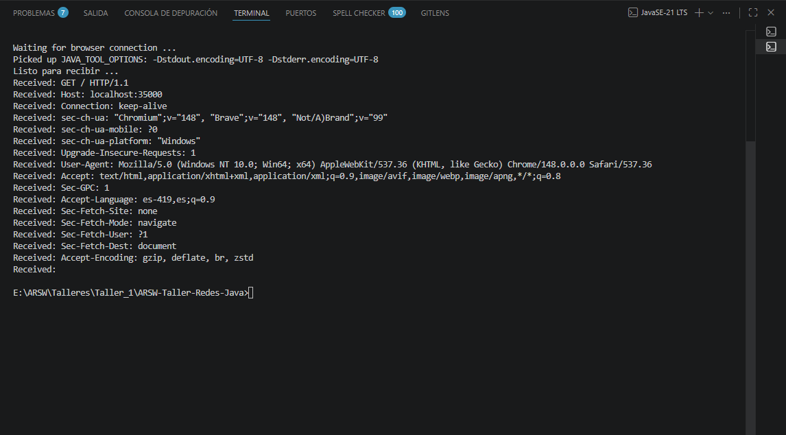
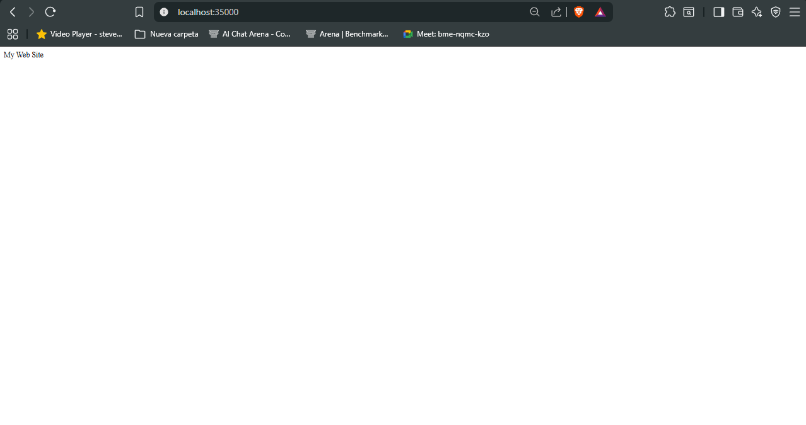

---

### 4.5.1. Multi-Request Web Server 

**Package:** `edu.eci.arsw.networking.ejercicio4_5_1` — **Completed**  
**File:** `src/main/java/edu/eci/arsw/networking/ejercicio4_5_1/MultiServer.java`

#### What it does

Extends the basic HTTP server from Exercise 4.4 to support **multiple sequential requests** without restarting. The server accepts one client at a time via an **outer loop** (`while (true)` → `accept()`), then handles multiple HTTP requests from that same browser via an **inner loop** (`while ((inputLine = in.readLine()) != null)`). Each request is parsed for the file path (e.g., `/index.html`, `/logo.svg`), the file is read from the `www/` directory, and it is sent back with the correct `Content-Type`. When the client disconnects, the server goes back to waiting for the next client.

This teaches how real web servers work — they never exit after one request.

#### Coding style

The implementation follows the **exact same structure and formatting** as the `HttpServer` from Exercise 4.4:
- `import java.net.*; import java.io.*;`
- `public static void main(String[] args) throws IOException`
- Two separate `try-catch` blocks for `ServerSocket` and `accept()`
- Same `PrintWriter` / `BufferedReader` variable layout
- Same `while ((inputLine = in.readLine()) != null)` + `if (!in.ready()) break;` pattern for reading HTTP headers
- Same brace style and indentation

The only structural addition is the outer `while (true)` loop that keeps the server alive for multiple client connections.

#### What was taken into account

1. **Two nested loops:**
   - **Outer loop** (`while (true)`): accepts new client connections via `serverSocket.accept()`
   - **Inner loop** (`while ((inputLine = in.readLine()) != null)`): reads multiple HTTP requests from the same client

2. **Same header detection as HttpServer** — uses `if (!in.ready()) break;` after each line, exactly like Exercise 4.4. When the browser finishes sending headers, `in.ready()` returns `false` and the server processes the request.

3. **GET path parsing** — checks `inputLine.startsWith("GET ")` and extracts the requested path with `inputLine.split(" ")[1]`

4. **Default file mapping** — if the path is `/`, it is mapped to `/index.html`

5. **File system serving** — files are read from the `www/` directory using `Files.readAllBytes()`

6. **Content-Type mapping** — a `switch` statement maps file extensions to MIME types

7. **Binary file support** — uses `BufferedOutputStream` alongside `PrintWriter` to send images without data corruption

8. **HTTP error handling** — returns `400 Bad Request` if the request line is malformed, `404 Not Found` if the file does not exist

#### Step-by-step implementation

| Step | What I did | Why |
|------|-------------|-----|
| 1 | Create a `ServerSocket` on port `35000` with the same `try-catch` as HttpServer | Consistency with Exercise 4.4 |
| 2 | Print `"Listo para recibir ..."` and enter the **outer loop** | Same message as HttpServer; the outer loop keeps the server alive forever |
| 3 | Call `accept()` inside the same `try-catch` pattern as HttpServer | Waits for a browser to connect |
| 4 | Set up `PrintWriter` (text output), `BufferedReader` (text input), and `BufferedOutputStream` (binary output) | Text headers are sent via `PrintWriter`; binary file data (images) must go through `BufferedOutputStream` to avoid corruption |
| 5 | **Inner loop:** `while ((inputLine = in.readLine()) != null)` — identical to HttpServer | Reads every line the browser sends; when the browser disconnects, `readLine()` returns `null` and the inner loop ends |
| 6 | Print `"Received: " + inputLine` — identical to HttpServer | Debug output showing the raw HTTP request |
| 7 | Check `inputLine.startsWith("GET ")` and extract the path with `split(" ")[1]` | The first line of an HTTP request is `GET /path HTTP/1.1`; `requestPath` holds the file being requested |
| 8 | Check `if (!in.ready()) break;` — **exactly like HttpServer** | When all headers have been received, `in.ready()` returns `false`. This breaks out of the header-reading phase and triggers the response |
| 9 | If `requestPath` is `null`, send `400 Bad Request` | The request line was missing or malformed |
| 10 | Map `/` to `/index.html` | Browsers request `/` for the default page |
| 11 | Build the file path: `"www" + requestPath` and check `file.exists()` | Files are served from the `www/` directory at the project root |
| 12 | If the file exists: read it with `Files.readAllBytes()`, determine MIME type with `getContentType()`, send HTTP headers (`200 OK`, `Content-Type`, `Content-Length`, `Connection: keep-alive`), then send the file bytes | `Content-Length` tells the browser exactly how many bytes to expect; `Connection: keep-alive` keeps the TCP connection open for the next request |
| 13 | If the file does not exist: send `404 Not Found` with an HTML error page | The browser shows a "404 Not Found" message |
| 14 | Reset `requestPath = null` and go back to the inner loop | The browser may send more requests (e.g., `/logo.svg` after `/index.html`) |
| 15 | When the inner loop ends (browser disconnected): close all streams and go back to the outer loop | Prepares for the next client |

#### Content-Type mapping

| Extension | MIME type |
|-----------|-----------|
| `.html`, `.htm` | `text/html` |
| `.css` | `text/css` |
| `.js` | `application/javascript` |
| `.json` | `application/json` |
| `.png` | `image/png` |
| `.jpg`, `.jpeg` | `image/jpeg` |
| `.gif` | `image/gif` |
| `.svg` | `image/svg+xml` |
| `.ico` | `image/x-icon` |
| (other) | `application/octet-stream` |

#### Sample files

The project includes a `www/` directory with:
- **`index.html`** — a styled HTML page that displays a title and references an SVG logo
- **`logo.svg`** — a simple geometric SVG graphic (blue and red circles)

You can add your own files to `www/` and they will be served automatically.

#### How to execute

**Step 1:** Start the server:
```bash
run_ejercicio.bat 4_5_1
```

You should see:
```
Listo para recibir ...
```

The server is now waiting for a browser to connect. It will **not** exit after one request.

**Step 2:** Open your browser to:
```
http://localhost:35000
```

You should see a styled page with:
- Title **"Multi-Server"** in the browser tab
- A heading "ARSW Multi-Server"
- A paragraph: "This page is served by the Multi-Request Web Server."
- An SVG logo with two circles (blue and red)

**Step 3:** Look at the terminal. You should see:
```
Received: GET / HTTP/1.1
Received: Host: localhost:35000
Received: Connection: keep-alive
...
Served: index.html
Received: GET /logo.svg HTTP/1.1
Received: Host: localhost:35000
...
Served: logo.svg
Received: GET /favicon.ico HTTP/1.1
...
(404 — browser asks for an icon, which does not exist)
Client disconnected.
```

The browser automatically requested **three resources**:
1. `/` → `index.html` (200 OK) 
2. `/logo.svg` → the SVG image (200 OK) 
3. `/favicon.ico` → 404 (normal; no favicon is configured) 

**Step 4:** The server stays alive. Refresh the page — it handles the requests again.

**Step 5:** Open a second browser tab to `http://localhost:35000/something.html` — the server responds with 404 because the file does not exist.

**Step 6:** Press `Ctrl+C` in the terminal to stop the server.

#### Expected output verification

| Browser request | Terminal output | Expected result |
|----------------|----------------|-----------------|
| `http://localhost:35000/` | `Received: GET /` → `Served: index.html` | Page with "Multi-Server" title and logo |
| (browser auto-requests `/logo.svg`) | `Received: GET /logo.svg` → `Served: logo.svg` | Logo displays below the text |
| (browser auto-requests `/favicon.ico`) | `Received: GET /favicon.ico` → (no "Served:") | 404 (harmless) |
| `http://localhost:35000/noexiste.html` | `Received: GET /noexiste.html` → (no "Served:") | Browser shows "404 Not Found" |

#### Example interaction

```
Terminal                                          Browser
───────────────────────────────────────────────────────────
$ run_ejercicio.bat 4_5_1
Listo para recibir ...
                                                  (navigate to http://localhost:35000)
Received: GET / HTTP/1.1
Received: Host: localhost:35000
...
Served: index.html                                →  Shows "ARSW Multi-Server" page
Received: GET /logo.svg HTTP/1.1
Received: Host: localhost:35000
...
Served: logo.svg                                  →  Logo appears below text
Received: GET /favicon.ico HTTP/1.1               →  (no icon, harmless 404)
...

Client disconnected.                              (close browser tab)
                                                  (server waits for next client)
Listo para recibir ...                            (ready for new connection)
```

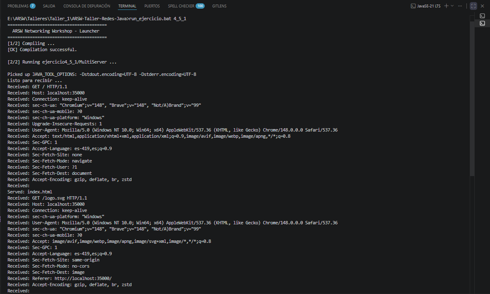
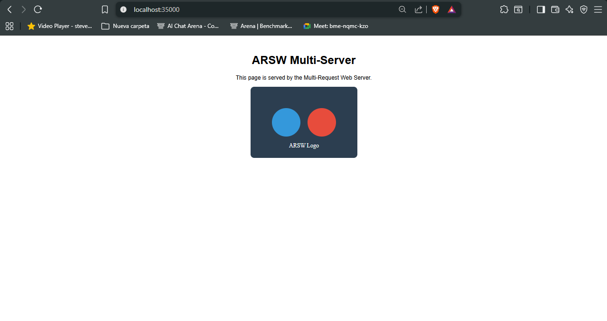

---

### 5.2.1. Datagram Time Client

**Package:** `edu.eci.arsw.networking.ejercicio5_2_1` — **Completed**  
**Files:**
- `src/main/java/edu/eci/arsw/networking/ejercicio5_2_1/DatagramTimeServer.java`
- `src/main/java/edu/eci/arsw/networking/ejercicio5_2_1/DatagramTimeClient.java`

#### What it does

A **UDP client-server** application for retrieving the current server time:
- **Server** (`DatagramTimeServer`): listens on port `4445`, responds to any incoming datagram with the current date/time string. Runs indefinitely in a `while(true)` loop.
- **Client** (`DatagramTimeClient`): sends a request every **5 seconds**, prints the received time, and if no response arrives (server offline), it keeps and displays the last known time. When the server comes back online, the client automatically recovers.

#### How UDP datagram communication works

Unlike TCP (which requires a connection handshake before sending data), UDP is **connectionless**:

```
CLIENT                                 SERVER
  |                                       |
  |  1. Sends empty datagram              |
  |  ─────────────────────────────────>   |  2. Receives the packet
  |                                       |  3. Gets current date
  |  4. Receives datagram with date       |
  |  <─────────────────────────────────   |  5. Sends response back
  |                                       |     to same client (IP+port)
  |  6. Sleeps 5 seconds                  |
  |  7. Goes back to step 1               |
```

**Server detailed flow (`DatagramTimeServer`):**

1. Creates a `DatagramSocket` **bound** to port `4445`. Any datagram sent to `localhost:4445` will reach this socket.
2. Enters a `while (true)` — never terminates unless the process is killed (Ctrl+C).
3. On each iteration:
   - Creates a 256-byte buffer and an empty `DatagramPacket` that will use the buffer.
   - Calls `socket.receive(packet)` — **blocks** until a datagram arrives from some client.
   - When a datagram arrives, the packet is filled with the received data **plus** the client's IP address and port.
   - Gets the current time with `new Date().toString()` — produces a string like `"Fri Jun 05 14:23:10 COT 2026"`.
   - Converts that string to bytes with `getBytes()`.
   - Extracts the IP address and port from the received packet (`packet.getAddress()`, `packet.getPort()`).
   - Creates a **new** `DatagramPacket` with the time bytes, the client's IP, and its port.
   - Calls `socket.send(packet)` to send the response.
   - Goes back to waiting for the next datagram.

**Client detailed flow (`DatagramTimeClient`):**

1. Creates a `DatagramSocket` **without binding** to a specific port — the OS assigns an ephemeral port automatically.
2. Sets a **3-second timeout** with `socket.setSoTimeout(3000)` — this is critical because `receive()` would block forever if the server is down.
3. Resolves the server IP: `InetAddress.getByName("127.0.0.1")` (localhost).
4. Enters a `while (true)`:
   - **Send phase:** creates a `DatagramPacket` targeting `127.0.0.1:4445` with an empty 256-byte buffer. Calls `socket.send(packet)`.
   - **Receive phase:** creates a new `DatagramPacket` for receiving and calls `socket.receive(packet)`.
     - If the server responds within 3s: extracts the bytes with `packet.getData()` (limited to `packet.getLength()`), converts them to String, updates `lastTime`, and prints it.
     - If 3s pass without a response: `SocketTimeoutException` is thrown. The client prints `lastTime` with `"(server offline)"` — **it does not crash, it does not terminate**.
   - Sleeps 5 seconds with `Thread.sleep(5000)`.
   - Repeats.

#### System inputs and outputs

| Component | Input | Output |
|-----------|-------|--------|
| **Server** | Network: UDP datagrams on port 4445 | Console: `"DatagramTimeServer listening on port 4445 ..."` on startup. Network: sends datagrams with current time to whoever sent one |
| **Client** | Network: UDP datagrams from the server (or timeout). Internal: `Thread.sleep(5000)` controls the rhythm | Console: prints `"Date: ..."` every 5s. If the server does not respond, prints `"Date: ... (server offline)"` |

#### Step-by-step implementation

**Server (DatagramTimeServer):**

| Step | What I did | Why |
|------|-------------|-----|
| 1 | Create a `DatagramSocket` bound to port `4445` | The server needs a fixed port so clients know where to send requests |
| 2 | If binding fails, print `"Could not listen on port: 4445."` and `System.exit(1)` | Port may be in use; fail fast with a clear message instead of a cryptic NullPointerException |
| 3 | Enter a `while (true)` loop | The server must keep running indefinitely to handle repeated client requests |
| 4 | Create a 256-byte buffer and a `DatagramPacket` for receiving | `DatagramPacket` wraps the buffer with the received data |
| 5 | Call `socket.receive(packet)` — blocks until a datagram arrives | The server waits passively for client messages |
| 6 | Get the current time with `new Date().toString()` | Converts the current date/time to a human-readable string |
| 7 | Convert the time string to bytes with `getBytes()` | `DatagramPacket` sends raw bytes over the network |
| 8 | Extract the client's address and port from the received packet | The response must be sent back to the same client that requested it |
| 9 | Create a new `DatagramPacket` with the time bytes, client address and port | The response packet is addressed specifically to the requesting client |
| 10 | Call `socket.send(packet)` to send the response | The client receives the time string |

**Client (DatagramTimeClient):**

| Step | What I did | Why |
|------|-------------|-----|
| 1 | Create an unbound `DatagramSocket` | The OS assigns a random port; the client does not need a fixed port |
| 2 | Set a **3-second timeout** with `socket.setSoTimeout(3000)` | Without a timeout, `receive()` would block forever if the server is down |
| 3 | Resolve `127.0.0.1` with `InetAddress.getByName()` | The server runs on localhost during testing |
| 4 | Enter a `while (true)` loop | The client must keep running, updating the time every 5 seconds |
| 5 | Create a `DatagramPacket` with destination `127.0.0.1:4445` and send it | The request datagram tells the server someone is asking for the time |
| 6 | Create a new `DatagramPacket` for receiving and call `socket.receive(packet)` | Waits for the server's response within the 3-second timeout |
| 7 | Extract the time string from the received packet's data | `packet.getData()` returns the raw bytes; `packet.getLength()` gives the actual data length |
| 8 | Update `lastTime` with the received string and print it | The current time is displayed and saved for fallback |
| 9 | Catch `SocketTimeoutException` if no response arrives within 3 seconds | Prints `lastTime` with `"(server offline)"` — the client keeps running |
| 10 | Sleep for **5 seconds** with `Thread.sleep(5000)` | The exercise requires updating every 5 seconds, not continuously |

#### Why this matters

This exercise introduces **UDP (User Datagram Protocol)** — a connectionless transport protocol:
- **No connection setup** — the client just sends a datagram without the three-way handshake that TCP requires
- **No guaranteed delivery** — datagrams may be lost, duplicated, or arrive out of order
- **No connection state** — the server does not track clients between requests
- **Lower overhead** — no acknowledgment packets, no retransmission, no congestion control

UDP is used when speed matters more than reliability:
- **DNS lookups** — one request, one response; if lost, the client retries
- **VoIP / video calls** — a lost packet is better than a delayed retransmission (audio would stutter)
- **Online gaming** — player position updates are sent frequently; old data is irrelevant
- **DHCP** — broadcast-based IP address assignment

The **timeout + retry** pattern is how real applications handle unreliable networks:
- The client never crashes when the server is down
- It degrades gracefully, showing stale data until the server recovers
- When the server comes back, the client automatically recovers in the next 5-second cycle

#### Key classes used

| Class | Role |
|-------|------|
| `java.net.DatagramSocket` | UDP socket for sending/receiving datagrams. Can be bound to a specific port (server) or unbound (client) |
| `java.net.DatagramPacket` | Wraps a byte buffer with address and port for UDP communication. Used both for sending (with destination) and receiving (without destination) |
| `java.net.InetAddress` | Represents an IP address (`127.0.0.1` for localhost) |
| `java.net.SocketTimeoutException` | Subclass of `IOException` thrown when `receive()` times out — indicates server is offline |
| `java.util.Date` | Provides the current server time for the response |
| `Thread.sleep()` | Pauses the client loop for the 5-second interval between requests |

#### Example interaction

**Terminal 1 — Server:**
```
$ run_ejercicio.bat 5_2_1
DatagramTimeServer listening on port 4445 ...
Press Ctrl+C to stop.
```
The server sits here without printing anything else. It only acts when a datagram arrives.

**Terminal 2 — Client (server online):**
```
Date: Fri Jun 05 14:23:10 COT 2026
Date: Fri Jun 05 14:23:15 COT 2026
Date: Fri Jun 05 14:23:20 COT 2026
```
Each line appears exactly every 5 seconds. The time changes because the server generates `new Date()` on every request.

**Terminal 2 — Client (server goes offline — press Ctrl+C on Terminal 1):**
```
Date: Fri Jun 05 14:23:25 COT 2026
Date: Fri Jun 05 14:23:30 COT 2026 (server offline)
Date: Fri Jun 05 14:23:35 COT 2026 (server offline)
```
The last received time stays frozen. The client does not crash, does not throw an exception — it just shows `"(server offline)"`.

**Terminal 2 — Client (server comes back online — restart the server):**
```
Date: Fri Jun 05 14:23:40 COT 2026 (server offline)
Date: Fri Jun 05 14:23:47 COT 2026    ← automatically recovered
Date: Fri Jun 05 14:23:52 COT 2026
```
The client detects that the server is responding again and goes back to showing the current time.

#### Run

**Terminal 1 — Start the server:**
```bash
run_ejercicio.bat 5_2_1
```

Or with `java` directly:
```bash
java -cp target/classes edu.eci.arsw.networking.ejercicio5_2_1.DatagramTimeServer
```

The server binds to port `4445` and waits for datagrams. Press `Ctrl+C` to stop the server (this simulates the server going offline).

**Terminal 2 — Start the client:**
```bash
# Via batch script
run_ejercicio.bat 5_2_1 client

# Via java directly
java -cp target/classes edu.eci.arsw.networking.ejercicio5_2_1.DatagramTimeClient
```

The client prints the current server time every 5 seconds.

**To test the recovery behavior:**
1. Start the server, then start the client — you should see time updates every 5 seconds
2. Press `Ctrl+C` on the server terminal — the client will show `(server offline)` for each cycle
3. Restart the server — the client will automatically recover and show the current time again

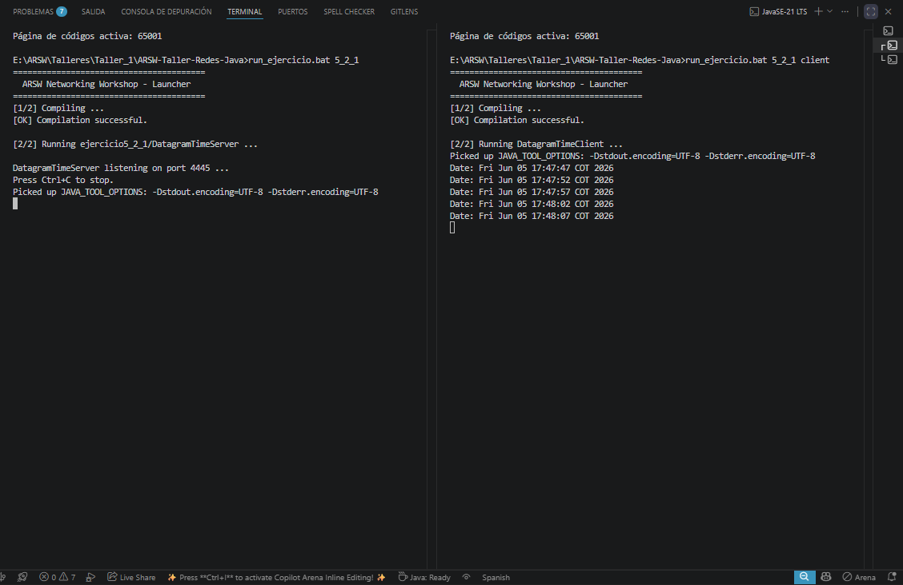
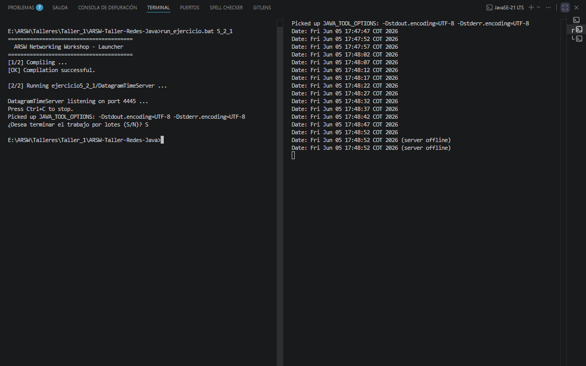
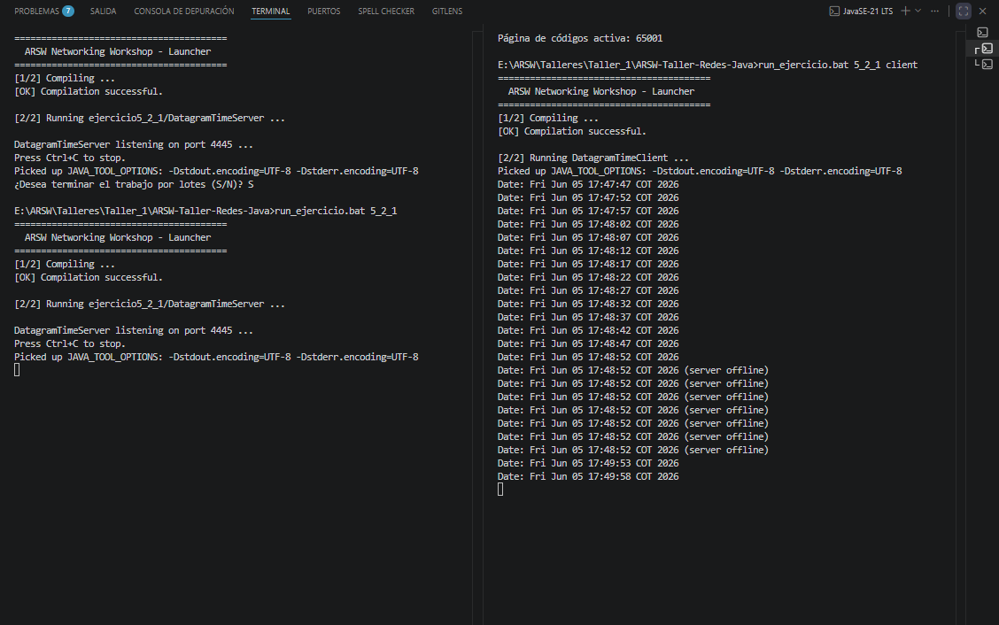

---

### 6.4.1. RMI Chat

**Package:** `edu.eci.arsw.networking.ejercicio6_4_1` — **Completed**  
**Files:**
- `src/main/java/edu/eci/arsw/networking/ejercicio6_4_1/Chat.java`
- `src/main/java/edu/eci/arsw/networking/ejercicio6_4_1/RmiChat.java`

#### What it does

A **peer-to-peer chat application** using Java RMI. Each instance acts as both a **server** (publishes its own remote chat object) and a **client** (connects to a remote peer's chat object). Messages are sent by invoking methods on the remote peer's object — the communication is transparent: calling a method on a remote object feels exactly like calling a local method.

#### How RMI communication works

Unlike TCP/UDP where you manually send and receive bytes over sockets, RMI lets you call methods on objects that live in another JVM as if they were local:

```
PEER A (port 10990)                    PEER B (port 10991)
  |                                       |
  |  1. createRegistry(10990)             |  1. createRegistry(10991)
  |  2. exportObject(stubA)               |  2. exportObject(stubB)
  |  3. rebind("chat", stubA)             |  3. rebind("chat", stubB)
  |                                       |
  |  4. getRegistry(127.0.0.1, 10991)     |
  |  5. lookup("chat") → obtiene stubB    |
  |  ───────────────────────────────────> |
  |  6. stubB.sendMessage("Hola")         |
  |                                       |  7. Imprime "Hola"
  |                                       |
  |                                       |  8. getRegistry(127.0.0.1, 10990)
  |                                       |  9. lookup("chat") → obtiene stubA
  |  <─────────────────────────────────── |
  |  11. Imprime "Bien!"                  |  10. stubA.sendMessage("Bien!")
```

Each peer:
1. Starts an **RMI registry** on its local port via `LocateRegistry.createRegistry(port)`
2. Creates an instance of `RmiChat` and **exports** it with `UnicastRemoteObject.exportObject()` — this generates a remote stub/proxy
3. **Binds** the stub to the registry under the name `"chat"`
4. Connects to the remote peer's registry and **looks up** their `"chat"` stub
5. Once connected, every `sendMessage()` call on the remote stub is transparently forwarded to the other JVM

#### Step-by-step implementation

**Interface (`Chat.java`):**

| Step | What I did | Why |
|------|-------------|-----|
| 1 | Create `public interface Chat extends Remote` | `Remote` is a marker interface that tells the JVM this interface can be invoked remotely |
| 2 | Declare `void sendMessage(String message) throws RemoteException` | `RemoteException` is a checked exception that all remote methods must declare — it covers network failures, serialization errors, etc. |

**Main class (`RmiChat.java`):**

| Step | What I did | Why |
|------|-------------|-----|
| 1 | Implement `Chat` interface | The class provides the actual implementation of `sendMessage()` |
| 2 | Declare `private static Chat remotePeer` | Holds the reference to the other peer's remote object; `static` so the main method can use it |
| 3 | Declare `private static int localPort` | Stores the local port for display in received messages |
| 4 | In `sendMessage()`: print `"\n[Peer " + localPort + "]: " + message` | Messages from the remote peer are printed to the local console with a prefix showing the remote peer's port |
| 5 | In `main()`: prompt user for **local port**, **remote IP**, **remote port** | The exercise requires asking for these values before connecting |
| 6 | Call `LocateRegistry.createRegistry(localPort)` | Starts an RMI registry programmatically on the local port — no need to run external `rmiregistry` |
| 7 | Create `new RmiChat()` and export with `UnicastRemoteObject.exportObject(chatImpl, 0)` | `exportObject()` generates a remote stub that the other peer can call; port `0` means the system picks an available port for the underlying TCP connection |
| 8 | Call `registry.rebind("chat", stub)` | Publishes the stub under the name `"chat"` so the other peer can find it by name |
| 9 | Enter retry loop: `getRegistry(remoteIp, remotePort).lookup("chat")` with 3s sleep | The remote peer may not be ready yet (one peer starts first). The retry loop waits until the remote registry and object are available |
| 10 | Once connected: print confirmation and enter message loop | The chat is now bidirectional — both peers have a reference to each other's stub |
| 11 | Read user input with `Scanner.nextLine()` | Each line typed by the user is a message to send |
| 12 | Call `remotePeer.sendMessage(message)` | This single line sends the message to the other JVM across the network — RMI handles serialization, transport, and dispatching |
| 13 | If `sendMessage()` throws `RemoteException`, print "Lost connection" and break | The remote peer may have disconnected (e.g., user typed `exit`) |

#### Why this matters

RMI is a paradigm shift from socket programming:
- **Abstraction:** you call methods, not send bytes. The network is invisible.
- **Object orientation:** remote objects behave like local objects — polymorphism, inheritance, and encapsulation work across the network.
- **Serialization:** Java objects (not just strings/bytes) can be passed as parameters and return values.
- **Garbage collection:** distributed garbage collection (DGC) tracks remote references.

RMI was the foundation for:
- **Enterprise JavaBeans (EJB)** — distributed business logic
- **Java CORBA** — language-independent remote objects
- **Modern microservices** — though REST/gRPC replaced RMI for cross-language needs, the concept of "call a remote function" is the same

This exercise is also your first **asymmetric communication** pattern:
- The **sender** is active — it calls a method
- The **receiver** is passive — it implements the method and waits to be called
- Each peer is **both** sender and receiver, which is the essence of peer-to-peer

#### Key classes used

| Class | Role |
|-------|------|
| `java.rmi.Remote` | Marker interface — declares that methods can be invoked from another JVM |
| `java.rmi.RemoteException` | Exception thrown when a remote call fails (network, serialization, etc.) |
| `java.rmi.registry.LocateRegistry` | Factory for getting or creating RMI registries |
| `java.rmi.registry.Registry` | Naming service that maps names to remote objects |
| `java.rmi.server.UnicastRemoteObject` | Exports a remote object and returns a stub that can be passed to clients |

#### Example interaction

**Terminal 1 — Peer A (starts first, waits for Peer B):**
```
=== RMI Chat ===
Enter your local port: 10990
Enter remote IP: 127.0.0.1
Enter remote port: 10991
Chat service published on port 10990
Waiting for remote peer on 127.0.0.1:10991 ...
Waiting for remote peer on 127.0.0.1:10991 ...
```

**Terminal 2 — Peer B (connects to Peer A):**
```
=== RMI Chat ===
Enter your local port: 10991
Enter remote IP: 127.0.0.1
Enter remote port: 10990
Chat service published on port 10991
Connected to 127.0.0.1:10990
Type your messages (type 'exit' to quit):

You:
```

**Terminal 1 — Peer A (automatically connects now that Peer B is up):**
```
Connected to 127.0.0.1:10991
Type your messages (type 'exit' to quit):

You:
```

**Terminal 2 — Peer B sends a message:**
```
You: Hello from peer B!
```

**Terminal 1 — Peer A receives it:**
```
You:
[Peer 10991]: Hello from peer B!
You:
```

**Terminal 1 — Peer A replies:**
```
You: Hi peer B, this is peer A!
```

**Terminal 2 — Peer B receives it:**
```
You:
[Peer 10990]: Hi peer B, this is peer A!
You:
```

#### Run

**Step 1 — Compile:**
```bash
mvn clean compile
```

**Step 2 — Open two terminals.**

Terminal 1 — Peer A (starts first, listens on port 10990):
```bash
run_ejercicio.bat 6_4_1
```
Then enter `10990`, `127.0.0.1`, `10991`.

Terminal 2 — Peer B (connects to Peer A, listens on port 10991):
```bash
run_ejercicio.bat 6_4_1
```
Then enter `10991`, `127.0.0.1`, `10990`.

**Step 3 — Chat!** Type messages in either terminal. They appear in the other.

**Step 4 —** Type `exit` in either terminal to disconnect.

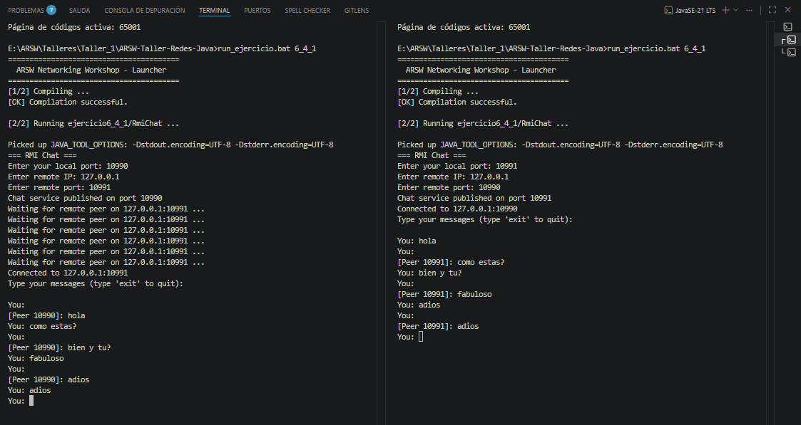

---

## Additional Utilities

### Workshop Launcher

**File:** `src/main/java/edu/eci/arsw/networking/WorkshopLauncher.java`

A menu-driven launcher that lets you pick any exercise interactively instead of typing the full class name. Uses Java reflection (`Class.forName()`, `Method.invoke()`) to dynamically load and run the selected exercise's `main()` method.

For TCP server exercises (4.3.1, 4.3.2), the launcher also provides a client mode via the `_c` suffix (e.g., `4_3_1_c`), which connects a `TcpClient` to the corresponding server.

**How it works:**
1. Prints a numbered menu of all exercises
2. Reads user input via `Scanner`
3. Maps the input to a fully-qualified class name using `resolveClassName()`
4. Loads the class and invokes its `main()` method via reflection
5. If the input ends with `_c`, it runs `TcpClient.main()` with the correct port instead

---

### TCP Client Utility

**Package:** `edu.eci.arsw.networking.util`  
**File:** `src/main/java/edu/eci/arsw/networking/util/TcpClient.java`

A reusable TCP client for testing any text-based TCP server. Connects to a given `host:port`, reads user input from the console, sends it to the server, and displays responses in real time.

#### Step-by-step implementation

| Step | What I did | Why |
|------|-------------|-----|
| 1 | Parse `host` and `port` from command-line args (defaults: `localhost:35000`) | Makes the client usable with any TCP server without recompiling |
| 2 | Create a `Socket` to the target host and port | Establishes the TCP connection to the server |
| 3 | Wrap the socket's output stream in a `PrintWriter` with auto-flush | Sends text lines to the server immediately |
| 4 | Wrap the socket's input stream in a `BufferedReader` | Reads response lines from the server |
| 5 | Start a **daemon reader thread** that prints server responses prefixed with `<< ` | Allows the user to type the next message while responses arrive asynchronously |
| 6 | Loop reading from `System.in` with `Scanner.nextLine()` | Each line typed by the user is sent to the server |
| 7 | Send the line via `out.println(input)` | The server receives the user's message |
| 8 | Break the loop when the user types `"Bye."` | Clean shutdown protocol matching the server-side `Bye.` handler |
| 9 | Call `socket.shutdownOutput()` to signal EOF to the server | Tells the server no more data is coming; the reader thread sees `null` from `readLine()` and exits |
| 10 | Wait 300ms then close the socket and join the reader thread | Ensures all pending server responses are printed before the client exits |

#### Why this matters

This client is a testing tool that mirrors how real network clients work under the hood:
- **Web browsers** are TCP clients that send HTTP requests and display responses
- **Database drivers** connect to database servers over TCP sockets
- **Chat applications** send and receive messages over persistent TCP connections

Having a reusable client means each server exercise can be tested without writing custom client code or relying on external tools like `telnet` or `ncat`.

#### Run

```bash
# Via batch script (port auto-detected from exercise number)
run_ejercicio.bat 4_3_1 client

# Via java directly
java -cp target/classes edu.eci.arsw.networking.util.TcpClient localhost 35000
```
